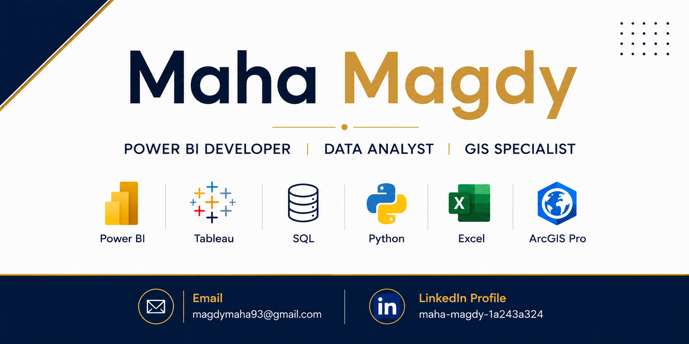

  

# Maha Magdy

**Power BI Developer | Data Analyst | GIS Specialist**

---

## About Me

GIS graduate with a strong interest in Data Analytics and Business Intelligence.

I enjoy transforming raw data into interactive dashboards and generating actionable insights using Power BI, SQL, Python, Tableau, and GIS technologies.

Currently expanding my knowledge in AI Agents and modern data analytics solutions.

---

## Technical Skills

### Business Intelligence
- Power BI
- Tableau
- DAX
- Power Query

### Data Analytics
- SQL
- Excel
- Python

### GIS
- ArcGIS Pro
- Google Earth
- ENVI
- Surfer

### Web Technologies
- HTML
- CSS

### Currently Learning
- AI Agents
- Prompt Engineering

---

## Featured Projects

### Call Center Dashboard

An interactive Power BI dashboard designed to monitor and analyze Call Center performance.

**Key Features**
- KPI Monitoring
- Agent Performance Analysis
- Performance Bottlenecks Analysis
- Interactive Filtering
- Business Performance Insights

**Tools**
- Power BI
- DAX
- Power Query
- Excel

**Repository**
- https://github.com/mahamagdy93-cell/Call-Center-Dashboard-PowerBI

---

## Career Interests

- Data Analyst
- Power BI Developer
- Business Intelligence Analyst
- GIS Analyst

---

## Contact

LinkedIn:
https://www.linkedin.com/in/maha-magdy-1a243a324/

Email:
magdymaha93@gmail.com
